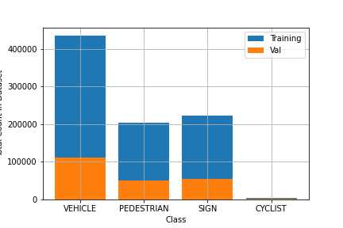
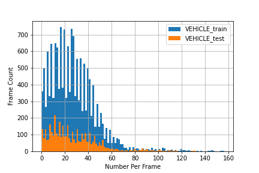
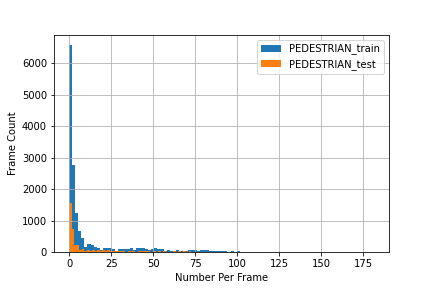
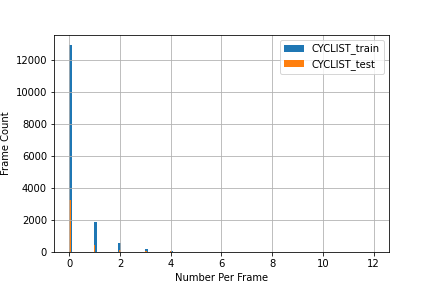
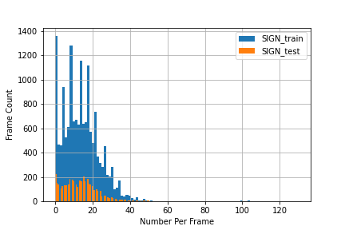

##### Tips for VoxelNet implementation
* Voxel size
* Max points in the voxel
* Feature aggregation
* Max num of voxels for the intermediate convolution
* RPN implementation in VocelNet paper vs (light one)
##### Data Distribution
* 10% of the data

